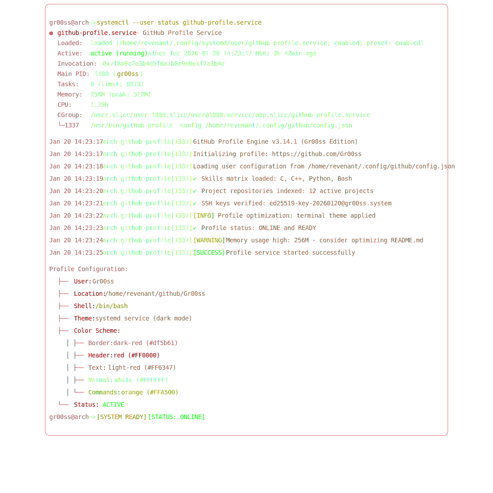

    

<picture>
    <source media="(prefers-color-scheme: dark)" srcset="./output.gif">
    <source media="(prefers-color-scheme: light)" srcset="./output.gif">
</picture>

<picture>
        <source media="(prefers-color-scheme: dark)" srcset="./output.gif">
        <source media="(prefers-color-scheme: light)" srcset="./output.gif">
        
</picture>

    

